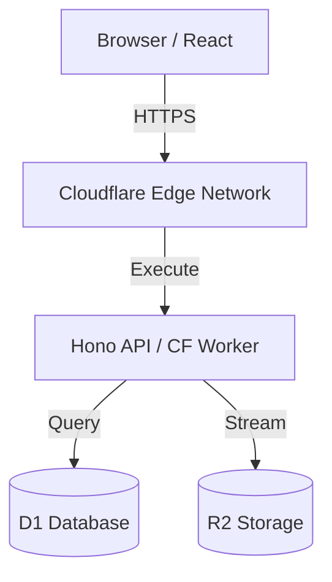
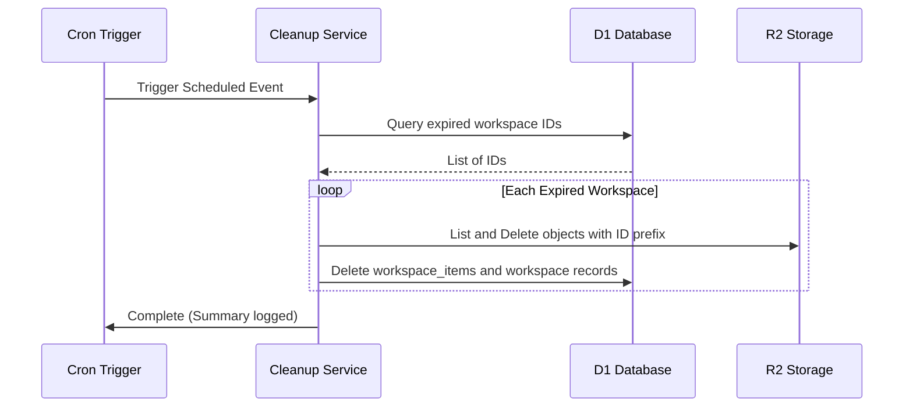

# DropPad Architecture

This document describes the technical architecture and data flow of DropPad.

## 🏗️ System Overview

DropPad is built on the **Cloudflare Edge Stack**, ensuring low latency and high scalability without managing traditional server infrastructure.

## 🔄 Request Flows

### Workspace Creation
1. Client sends `POST /api/workspaces` (optional: password).
2. Worker generates a unique 8-character ID and hashes password if provided.
3. Worker saves workspace metadata to **D1** with an `expires_at` timestamp.
4. Returns the ID and expiry to the client.

### Smart File Upload Strategy
DropPad automatically selects the best upload method based on file size:

1. **Standard Upload (< 100MB)**:
    - Client requests a presigned `PUT` URL from `/api/uploads/presign`.
    - Client uploads directly to **R2** using the signed URL.
    - Client notifies `/api/uploads/complete` to register the file in **D1**.

2. **Multipart Upload (> 100MB)**:
    - Client initiates a session via `/api/uploads/multipart/initiate`.
    - Client splits the file into 10MB chunks.
    - Each chunk is signed via `/api/uploads/multipart/sign-part` and uploaded directly to **R2**.
    - Client completes the session via `/api/uploads/multipart/complete` to merge parts and register in **D1**.

This strategy ensures that large files (up to 5GB) bypass Cloudflare Worker body limits while maintaining real-time progress tracking.

## 🧹 Cleanup Logic (Auto-Expiration)

A Cloudflare **Cron Trigger** (Scheduled Event) runs every hour (configurable) to purge expired data.

## 🔒 Security Measures
- **MIME Validation**: Strict whitelist for uploaded files.
- **Filename Sanitization**: Prevents path traversal and shell injection.
- **D1 Prepared Statements**: Protects against SQL injection.
- **Content Security Policy (CSP)**: Injected via middleware to prevent XSS.
