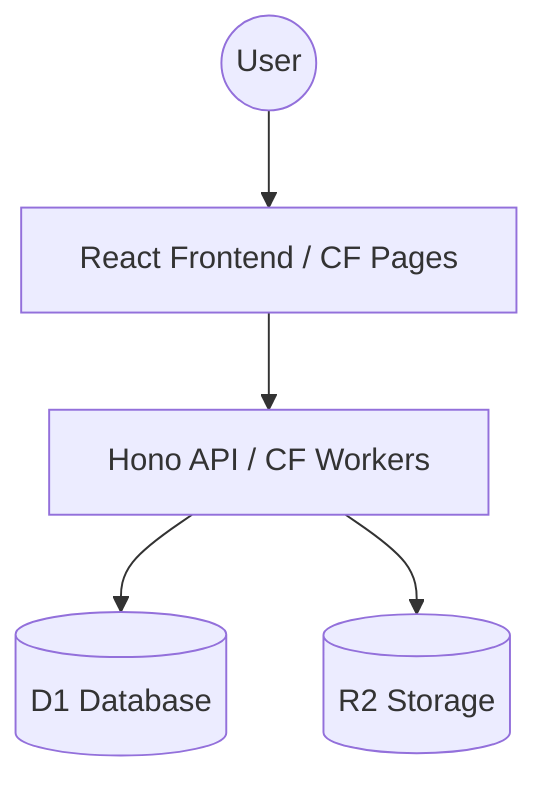

# DropPad 🚀

**DropPad** is a lightweight, temporary workspace application designed for developer teams. It solves the "quick transfer" problem: sharing snippets, notes, and files between restricted environments (like VMs) and local machines without the friction of accounts or permanent storage.

[](LICENSE)
[](https://workers.cloudflare.com/)

---

## 📖 Table of Contents
- [✨ Key Features](#-key-features)
- [🛑 The Problem](#-the-problem)
- [🏗️ Architecture](#-architecture)
- [🚀 Quick Start](#-quick-start)
- [🔒 Security & Reliability](#-security--reliability)
- [🌐 Deployment](#-deployment)
- [🗺️ Roadmap](#-roadmap)
- [🤝 Contributing](#-contributing)

---

## ✨ Key Features

- **Zero Friction**: No accounts, no logins, no persistent tracking.
- **Advanced Uploads**: Multiple files with real-time progress, cancellation, and retries.
- **Clipboard-First**: Paste images or text directly (Ctrl+V) for instant sharing.
- **Self-Cleaning**: Automated 24-hour expiration keeps your data ephemeral and private.
- **Mobile Hand-off**: Integrated QR code sharing for quick mobile access.
- **Markdown Ready**: Rich text rendering for all notes and code snippets.

## 🛑 The Problem
Developers often work across isolated environments (restricted VMs, remote servers, local machines). Moving a simple code snippet or a screenshot between these often requires emailing yourself, using private Slack channels, or clunky cloud drives. **DropPad** provides a "temporary clipboard in the cloud" that is fast, secure, and automatically cleans up after itself.

## 🏗️ Architecture

DropPad is a serverless application built entirely on the **Cloudflare Edge Stack**.


Detailed technical documentation can be found in [ARCHITECTURE.md](ARCHITECTURE.md).

## 🚀 Quick Start

### Prerequisites
- Node.js LTS
- pnpm
- [Wrangler CLI](https://developers.cloudflare.com/workers/wrangler/install-and-update/)

### Local Development (Recommended)
The easiest way to start developing is using Docker:
```bash
docker-compose up
```

### Local Development (Manual)
1. **Install Dependencies**: `pnpm install`
2. **Setup D1 Database**:
   ```bash
   cd apps/api
   pnpm exec wrangler d1 execute droppad-db --file=./schema.sql --local
   ```
3. **Start All Services**: `pnpm dev`
   - Frontend: `http://localhost:5173`
   - Backend: `http://localhost:8787`

## 🔒 Security & Reliability
- **MIME Validation**: Prevents execution of risky file types.
- **Filename Sanitization**: Protects against path traversal.
- **Observability**: Structured JSON logging with request tracing.
- **Quotas**: Built-in limits for file counts and workspace sizes.

## 🌐 Deployment
DropPad is designed to be self-hosted on your own Cloudflare account (Free tier compatible).

1. **D1 Setup**: `wrangler d1 create droppad-db`
2. **R2 Setup**: `wrangler r2 bucket create droppad`
3. **Configure**: Update `apps/api/wrangler.toml` with your `database_id`.
4. **Deploy API**: `pnpm --filter api deploy`
5. **Deploy Frontend**: Connect your repo to **Cloudflare Pages** and set the build command to `pnpm --filter web build` with output directory `apps/web/dist`.

## 🗺️ Roadmap
See our [ROADMAP.md](ROADMAP.md) for planned features like WebSockets and Client-side encryption.

## 🤝 Contributing
Contributions are welcome! Please see [CONTRIBUTING.md](CONTRIBUTING.md) for guidelines.

---

### 📝 License
Distributed under the MIT License. See `LICENSE` for more information.

*Built with ❤️ by [Your Name/Portfolio Link]*
