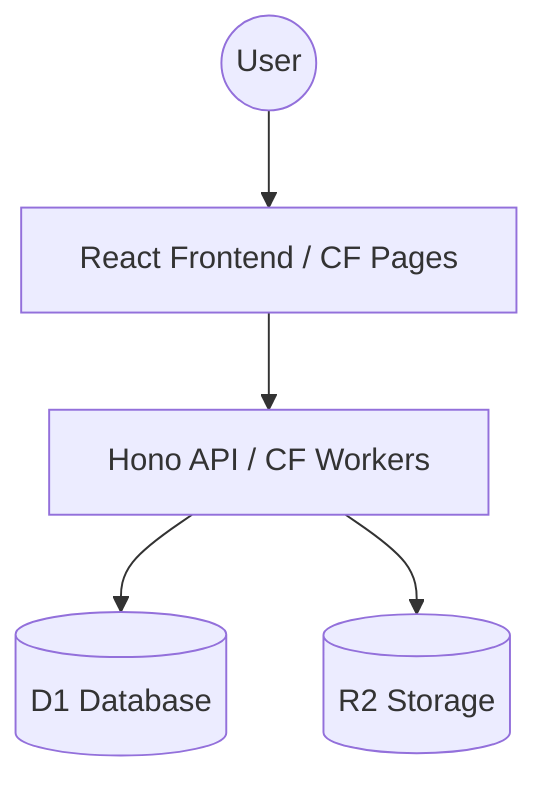

# DropPad 🚀

**DropPad** is a lightweight, temporary workspace application designed for developer teams. It solves the "quick transfer" problem: sharing snippets, notes, and files between restricted environments (like VMs) and local machines without the friction of accounts or permanent storage.

---

## 🚀 Step 1: Deploy in 5 Minutes (No Tech Knowledge Needed)

DropPad runs on Cloudflare for free. Follow these simple steps to get your own instance:

1. **Get the Code**: Click the "Use this template" or "Fork" button on GitHub to get your own copy of this project.
2. **Cloudflare Account**: Sign up for a free [Cloudflare Account](https://dash.cloudflare.com/sign-up).
3. **Connect to Pages**:
   - Go to **Workers & Pages** > **Create application** > **Pages** > **Connect to Git**.
   - Select your `drop-pad-app` repository.
   - **Build settings**:
     - Framework preset: `Vite`
     - Build command: `pnpm install && pnpm --filter web build`
     - Build output directory: `apps/web/dist`
   - Click **Save and Deploy**.
4. **Setup Database & Storage**:
   - In Cloudflare Dashboard, go to **Workers & Pages** > **D1** > **Create database** > Name it `droppad-db`.
   - Go to **R2** > **Create bucket** > Name it `droppad`.
5. **Connect Everything**:
   - Go back to your **Pages** project settings > **Functions** > **Compatibility flags** > Add `nodejs_compat`.
   - Under **Bindings**, add:
     - **D1 database binding**: Variable name `DB`, select `droppad-db`.
     - **R2 bucket binding**: Variable name `STORAGE`, select `droppad`.
   - Redeploy your project. **Done!**

---

## ✨ Key Features

- **Zero Friction**: No accounts, no logins, no persistent tracking.
- **Support for All Files**: Share `.drawio`, `.pdf`, Office docs, images, and code snippets.
- **Clipboard-First**: Paste images or text directly (**Ctrl+V**) for instant sharing.
- **Advanced Uploads**: Queue-based multi-file uploads with real-time progress.
- **Self-Cleaning**: Automated 24-hour expiration keeps your data ephemeral and private.
- **Mobile Hand-off**: Integrated QR code sharing for quick mobile access.
- **Markdown Ready**: Rich text rendering for all notes.

## 📖 System Guide

### Using your Workspace
- **Create**: Click "Create Workspace" on the landing page to get a private URL.
- **Share**: Use the **Share** button to copy the link or the **QR Code** icon for mobile access.
- **Notes**: Type directly into the text area. Markdown is supported (e.g., `### Header`, `**Bold**`).
- **Files**: Drag files into the browser window or use the **Upload** button. 
- **Clipboard**: Copy an image or file on your machine and press **Ctrl+V** in the workspace to upload instantly.
- **Manage**: Every item has a **Delete** button (trash icon) if you want to remove it before the auto-expiration.

### Technical Reference

#### Environment Variables & Bindings
The following bindings are required in Cloudflare:
| Binding | Type | Description |
| --- | --- | --- |
| `DB` | D1 Database | Stores workspace metadata and item lists. |
| `STORAGE` | R2 Bucket | Stores the actual file blobs. |

#### Operational Limits (Quotas)
Configurable in `wrangler.toml` or Cloudflare Dashboard:
- `MAX_UPLOAD_SIZE_MB`: Max size per file (Default: 512MB).
- `MAX_FILES_PER_WORKSPACE`: Max items per workspace (Default: 100).
- `MAX_TOTAL_WORKSPACE_SIZE_MB`: Max storage per workspace (Default: 2GB).
- `WORKSPACE_EXPIRE_MINUTES`: Time until auto-deletion (Default: 1440 min / 24h).

#### Cleanup Cron Trigger
To enable automated cleanup, add a **Cron Trigger** to your Cloudflare Worker:
1. Go to **Workers & Pages** > Select your `droppad-api` worker.
2. Go to **Settings** > **Triggers** > **Cron Triggers**.
3. Add `0 * * * *` (Runs every hour).

## 🏗️ Architecture

DropPad is a serverless application built entirely on the **Cloudflare Edge Stack**.

Detailed technical documentation can be found in [ARCHITECTURE.md](ARCHITECTURE.md).

## 🧪 Local Development (For Developers)
1. **Install Dependencies**: `pnpm install`
2. **Setup D1 Database**: `cd apps/api && pnpm exec wrangler d1 execute droppad-db --file=./schema.sql --local`
3. **Start All Services**: `pnpm dev`
4. **Docker Option**: `docker-compose up`

## 🗺️ Roadmap
See our [ROADMAP.md](ROADMAP.md) for planned features like WebSockets and Client-side encryption.

---

### 📝 License
Distributed under the MIT License. See `LICENSE` for more information.

*Built with ❤️ by Nuttakon*
